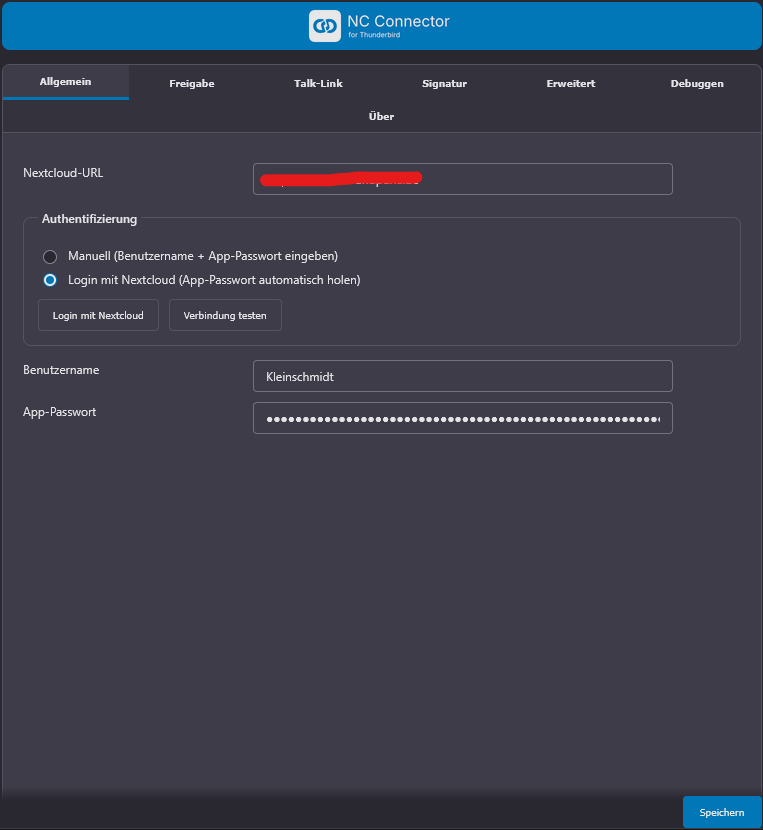
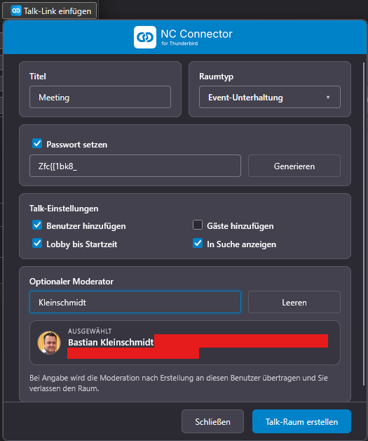
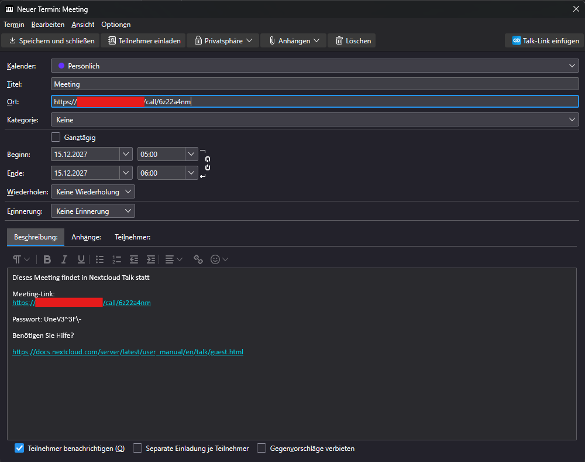
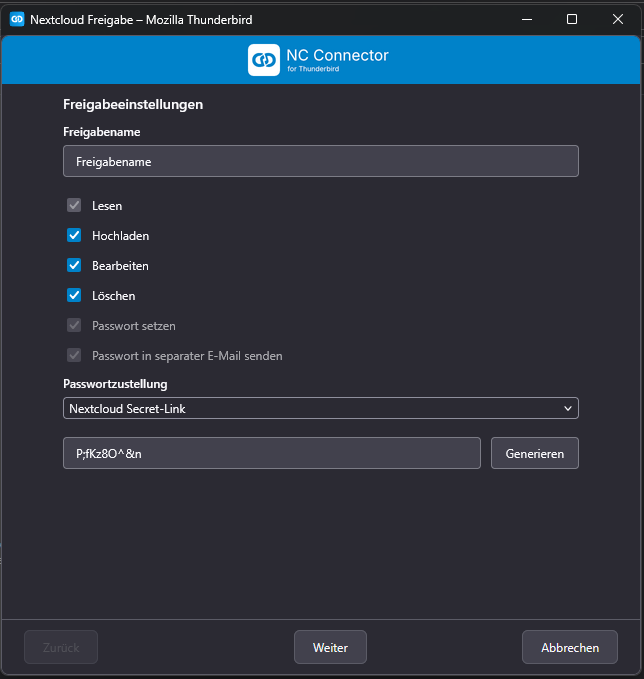
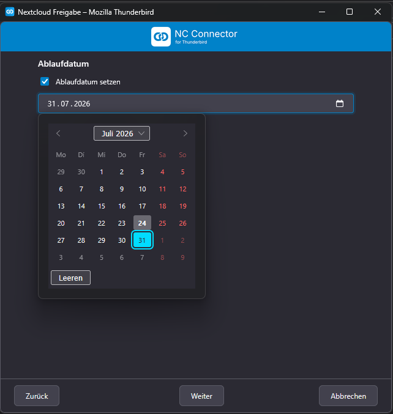
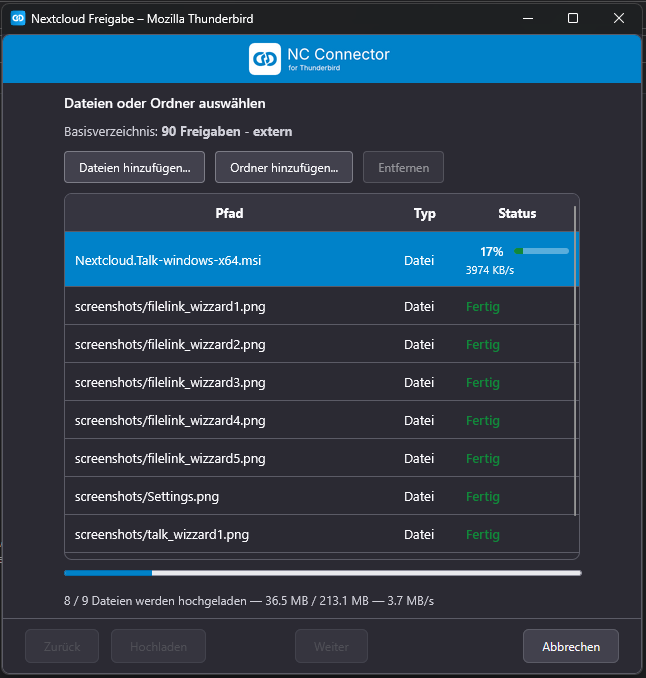
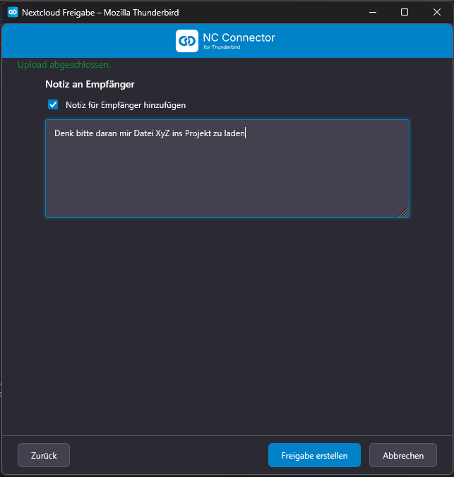
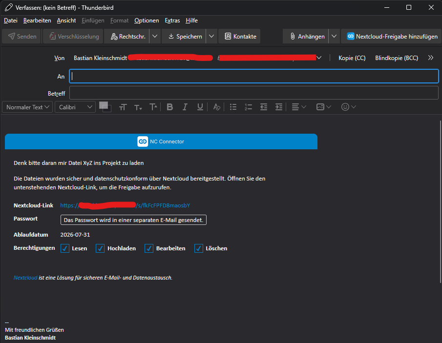

[English](https://github.com/nc-connector/NC_Connector_for_Thunderbird/blob/main/README.md) | [Deutsch](https://github.com/nc-connector/NC_Connector_for_Thunderbird/blob/main/README.de.md)
[Admin Guide](https://github.com/nc-connector/NC_Connector_for_Thunderbird/blob/main/docs/ADMIN.md) | [Development Guide](https://github.com/nc-connector/NC_Connector_for_Thunderbird/blob/main/docs/DEVELOPMENT.md)

##
NC Connector for Thunderbird connects Thunderbird directly with Nextcloud Talk and secure Nextcloud sharing. One click opens a modern wizard, creates Talk rooms with lobby and moderator delegation, and inserts the meeting link (including password) into the event. From the compose window, you can generate a Nextcloud share with upload folder, expiration date, password, and personal message. No copy-paste juggling and no open links in emails: everything stays in Thunderbird and is stored cleanly in your Nextcloud.

This is a community project and is not an official Nextcloud GmbH product.

## Highlights

- **One-click Nextcloud Talk**
  Open an event, choose Nextcloud Talk, configure the room, and define a moderator. Optionally add invitees to the room (separately for internal Nextcloud users and external e-mail guests). The wizard writes title/location/description (including help link) into the event.
- **Sharing deluxe**
  The "Add Nextcloud Share" button starts the sharing assistant with upload queue, password generator, expiration date, and note field. The finished share is inserted as formatted HTML into the email.
- **Attachment automation**
  Optional compose rules can route attachments directly through NC Connector (always or above a configurable total-size threshold). If threshold is exceeded, users can either share via NC Connector or remove the last selected attachment batch.
- **Enterprise security**
  Lobby until start time, moderator delegation, automatic cleanup of unsaved events, required passwords, and expiration policies protect sensitive meetings and files.
- **Central backend policies (optional)**
  If the optional NC Connector backend is installed, Talk and Sharing defaults can be managed centrally. The add-on checks backend status whenever the Talk or Sharing wizard opens, when Settings open, and again when Settings are saved, applies valid-seat policies, and locks admin-controlled settings while still showing their effective values.
- **Seamless Nextcloud integration**
  Login Flow V2, automatic room tracking, and debug logs in [NCBG], [NCUI][Talk], [NCUI][Sharing], and [ncCalToolbar] help with troubleshooting.
- **ESR-ready**
  Optimized and tested for Thunderbird ESR 140.X with a minimal experiment footprint.

## Changelog

See [`CHANGELOG.md`](https://github.com/nc-connector/NC_Connector_for_Thunderbird/blob/main/CHANGELOG.md).

## Feature overview

### Nextcloud Talk directly from the event
- The Talk button in event editors is provided via Thunderbird's standard `calendar_item_action`.
- Talk popup with lobby, password, listable option, room type, and moderator search.
- Automatic insertion of title, location, and description (including help link and password) into the event.
- Lobby timer synchronization uses `X-NCTALK-START` (UTC epoch seconds) as the authoritative value.
- Room tracking, lobby updates, delegation workflow, and cleanup if the event is discarded or moved.
- Calendar changes (drag-and-drop or dialog edits) keep lobby/start time in sync on the server.
- Optional invitee sync after saving the event:
  - **Users:** internal Nextcloud users are added directly to the room (requires active Nextcloud system address book access).
  - **Guests:** external e-mail guests are invited as guests (they may receive an additional invitation e-mail from Nextcloud).

### Nextcloud Sharing in the compose window
- Four steps (share, expiration date, files, note) with a password-protected upload folder.
- Upload queue with duplicate checks, progress display, and optional share without upload.
- Automatic HTML blocks with link, password, expiration date, and optional note.
- If a share was inserted but the compose tab is closed without successful send, the share folder is cleaned up automatically on the server.
- Optional separate password delivery:
  - default + wizard toggle: "Send password in separate email"
  - requires the optional NC Connector backend plus an active seat assigned to the current user
  - only active when password protection is enabled
  - main mail hides inline password and shows a separate-password notice
  - password-only follow-up mail targets the main mail `To` recipients only
  - automatic follow-up send reuses the same Thunderbird sender identity as the main mail
  - if sender identity resolution is ambiguous/unavailable, or if automatic send fails, Thunderbird opens a prefilled manual fallback draft
  - password-follow-up problems never delete the committed share after the main mail was sent
  - successful password-mail delivery triggers a desktop success notification
- Optional attachment automation:
  - "Always handle attachments via NC Connector"
  - "Offer upload above X MB" based on total attachment size
  - threshold prompt with explicit decision ("Share with NC Connector" or "Remove last selected attachments"); remove action deletes the last selected attachment batch
  - attachment-mode wizard launch in step 3 with ZIP download links (`/s/<token>/download`)
  - recipient permissions in attachment mode are enforced as read-only (independent of sharing defaults)
  - automatic lock + guidance note in add-on settings if Thunderbird's own "Upload for files larger than" setting is active

### Administration & compliance
- Login Flow V2 (app password is created automatically) and central options (base URL, debug mode, sharing paths, default values for Sharing/Talk).
- Optional NC Connector backend status/policy mode:
  - checked on Talk wizard open, Sharing wizard open, Settings open, and Settings save
  - active valid seat enables backend policy values and admin locks
  - missing backend / no seat / invalid seat falls back to local add-on settings
  - invalid seat states are surfaced in the UI so users can contact their administrator
- backend share/Talk templates are only activated when the language override is set to `Custom`
- `Custom` is only shown when the NC Connector backend endpoint exists and stays disabled unless the effective backend policy for that domain is actually `custom` and provides a template
- if `Custom` is selected but the backend template is empty or unavailable, Thunderbird falls back to the local UI-default text block
- Full internationalization (see [`Translations.md`](https://github.com/nc-connector/NC_Connector_for_Thunderbird/blob/main/Translations.md)) and structured debug logs for support cases, including attachment automation traces in `[NCBG]` and `[NCUI][Sharing]`.

## System requirements
- Thunderbird ESR 140.X (Windows/macOS/Linux)
- Nextcloud with Talk & Sharing (DAV) enabled
- Active Nextcloud system address book access (required for moderator/user search and participant toggles "Add users" / "Add guests")
- App password or Login Flow V2

## Installation
1. Install the current XPI release (for example `nc4tb-3.0.2.xpi`) in Thunderbird (Add-ons > Gear > Install Add-on From File).
2. Restart Thunderbird.
3. In the add-on options, enter base URL, user, and app password or start the login flow.

## Support & feedback
- **Troubleshooting:** Enable debug mode in the options for verbose traces; relevant logs appear as [NCBG], [NCUI][Talk], [NCUI][Sharing], and [ncCalToolbar] in Thunderbird’s developer console. Runtime errors still use `console.error(...)` even when debug mode is off.
- **System address book mismatch (enabled in admin UI, but still unavailable):** see Admin Guide section
  ["System address book required for user search and moderator selection"](https://github.com/nc-connector/NC_Connector_for_Thunderbird/blob/main/docs/ADMIN.md#system-address-book-required-for-user-search-and-moderator-selection)
  for the `occ` repair sequence and DAV export verification URL.

Good luck with secure, professional work using NC Connector for Thunderbird!

## Screenshots

<strong>Settings menu</strong>

|  |
| --- |

<strong>Talk wizard</strong>

|  |  |
| --- | --- |

<strong>Sharing wizard</strong>

|  |  |
| --- | --- |
|  |  |
| --- | --- |
|  |  |
| --- | --- |

